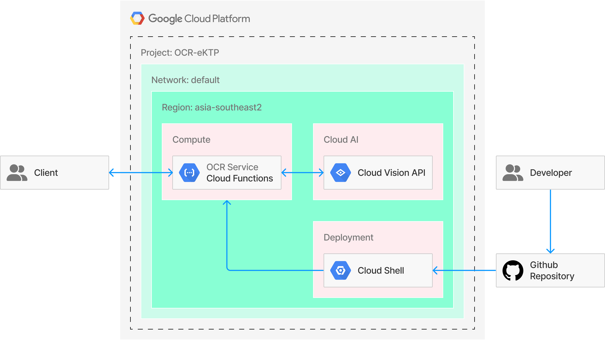

# Identify

Automation of Indonesian Identity Card (e-KTP) Data Extraction Using Cloud Functions and Cloud Vision API

## Architecture



## Deployment

1. Go to Google Cloud Platform Console.
2. Create a Google Cloud project.
3. Make sure that billing is enabled for your Google Cloud project.
4. Open Cloud Shell.
4. Enable Cloud Build, Cloud Functions, and Cloud Vision APIs.

    ```shell
    gcloud services enable \
      cloudbuild.googleapis.com \
      cloudfunctions.googleapis.com \
      vision.googleapis.com
    ```

6. Clone this repository.

    ```shell
    git clone https://github.com/arryaaas/Identify.git
    ```

7. Move directory.

    ```shell
    cd ~/Identify
    ```

8. Set default region for Cloud Functions.

    ```shell
    gcloud config set functions/region asia-southeast2
    ```

9. Deploying Functions.

    ```shell
    gcloud functions deploy ocr-service \
      --runtime python39 \
      --trigger-http \
      --entry-point parse_multipart \
      --allow-unauthenticated
    ```

## Live URL 

https://asia-southeast2-glossy-attic-357602.cloudfunctions.net/ocr-service

## License

Distributed under the MIT License. See `LICENSE` for more information.

## Contact

Mochammad Arya Salsabila - Aryasalsabila789@gmail.com
